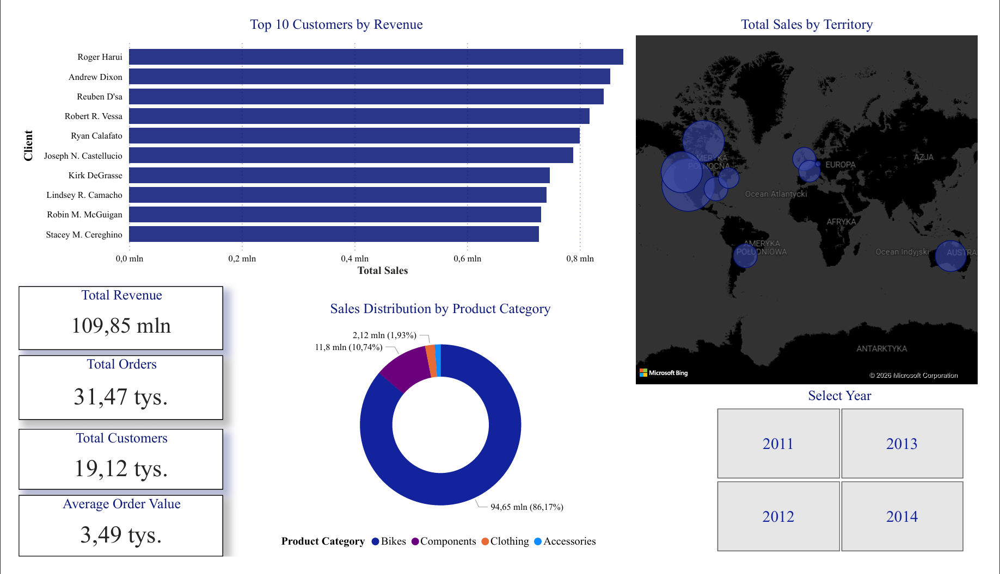

# AdventureWorks2014_sales_performance_analysis
## Project Overview
The primary objective of this project is to conduct a comprehensive sales performance analysis using the AdventureWorks2014 database.
By leveraging Microsoft SQL Server (T-SQL) and Power BI, the project aims to extract actionable business intelligence to:
- Identify revenue drivers: Pinpoint the top-performing products and categories to optimize inventory and marketing spend.
- Customer segmentation: Analyze purchasing patterns to identify high-value customers for targeted CRM and loyalty initiatives.
- Strategic growth: Provide a data-driven foundation for management to make informed decisions regarding regional sales strategies and product lifecycle management.

## Tools & Technologies
- Microsoft SQL Server Management Studio (SSMS)
- Microsoft Power Bi Desktop
- AdventureWorks2014 sample database
- GitHub for version control

|    Repository structure              |     Business purpose |
| :--- | :--- |
| ['01_top_10_products.sql'](./01_top_10_products.sql) | - Identifies inventory priorities and high-margin stock |
| ['02_most_profitable_categories.sql'](./02_most_profitable_categories.sql)| - Supports budget allocation for marketing campaigns |
| ['03_top_customers.sql'](./03_top_customers.sql)|- Enables the Sales team to launch loyalty programs for VIPs |
| ['04_sales_by_year.sql'](./04_sales_by_year.sql)| - Tracks year-over-year (YoY) growth to evaluate the company's long-term market position |
| ['05_regional_sales_performance.sql'](./05_regional_sales_performance.sql)| - Locates underperforming regions for sales team intervention |
| 'README.md'                          | - Project overview and documentation |

## Planned Analyses
1. Top 10 products  
2. Most profitable categories  
3. Top customers  
4. Sales by year  
5. Regional sales performance

## 📊 Interactive Power BI Dashboard
Building on the SQL analyses, I developed an interactive dashboard to visualize key business metrics and performance indicators.

Key Features:
-Interactive KPI Cards: Real-time summary of Total Revenue, Total Orders, Total Customers, and Average Order Value using DAX measures.
-Geospatial Analysis: A custom dark-mode map visualizing global sales distribution across territories.
-Dynamic Filtering: A Select Year slicer powered by a custom Calendar table, allowing for seamless data exploration across different time periods.
-Product Distribution: Breakdown of sales by product category, highlighting the dominance of the 'Bikes' segment.

[Download full raport PDF](./Dashboard_AdventureWorks.pdf)
[Power BI Source File](./Dashboard_AdventureWorks.pbix)
## Author
Gabriela Kozubal
